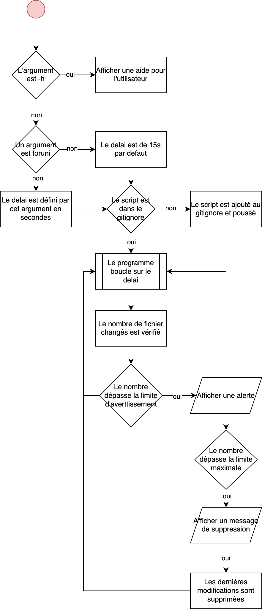

# README - Script de Surveillance Git "Manon"

Ce script Bash, baptisé "Manon", a été créé pour surveiller les modifications non commitées dans un référentiel Git. Il utilise des notifications pour alerter l'utilisateur lorsque le nombre de fichiers modifiés atteint un seuil spécifié.

## Utilisation

### Configuration

Le script offre quelques paramètres configurables :

- `$1` (argument optionnel) : délai entre chaque analyse (par défaut 15 secondes).
- `SEUIL_FICHIER_ALERT` : Nombre minimal de fichiers modifiés avant l'envoi d'une alerte.
- `SEUIL_FICHIERS_MAX` : Nombre maximal de fichiers modifiés avant d'arrêter le processus.

Pour plus d'informtations, le script dispose d'un argument -h qui founit une petite documentation

### Notifications

Le script utilise des notifications pour informer l'utilisateur des changements. Actuellement, il prend en charge les notifications sur macOS via AppleScript. Sur Windows, une notification de type boîte de dialogue est affichée.

### Dépendances

Le script dépend de Git pour vérifier les modifications dans le référentiel. Assurez-vous que Git est installé sur votre système.

### Utilisation

1. **Démarrage du Script :** Exécutez le script en spécifiant un délai entre chaque analyse (optionnel) :
   ```bash
   ./manon.bash [delai_entre_analyse]
   ```
   Par exemple :
   ```bash
   ./manon.bash 30
   ```
   Démarrera le script avec un délai de 30 secondes entre chaque analyse.

2. **Arrêt du Script :** Pour arrêter le script, utilisez `Ctrl + C` dans le terminal où le script est en cours d'exécution.

### Configuration Gitignore

Le script s'assure de s'ajouter lui-même au fichier `.gitignore`. Cela garantit que le script ne sera pas suivi par Git.

### Avertissements

- **Réinitialisation dure du référentiel :** Lorsque le nombre maximal de fichiers modifiés est atteint, le script effectue une réinitialisation dure (`git reset --hard`) pour annuler toutes les modifications non commitées. 

## Améliorations Possibles

- **Compatibilité Multi-plateforme :** Actuellement, le script prend en charge macOS et Windows pour les notifications. Ajoutez une prise en charge pour d'autres systèmes d'exploitation.
  
- **Paramètres Externes :** Rendez les paramètres configurables à partir de l'extérieur pour une personnalisation facile.

- **Interface Utilisateur Améliorée :** Améliorez l'interface utilisateur en affichant des messages plus informatifs et en rendant le script interactif.

- **Gestion des Erreurs :** Ajoutez une gestion robuste des erreurs pour traiter les situations exceptionnelles de manière appropriée.

### Algorigramme du fonctionnement du script
